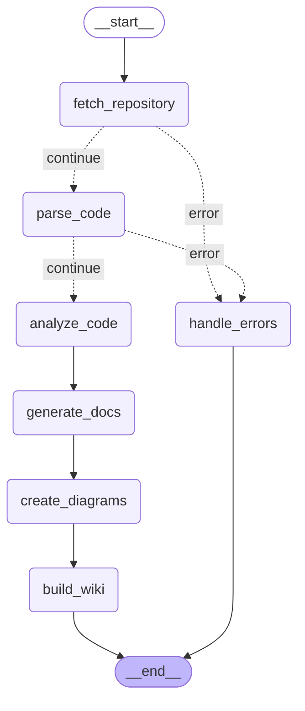

```mermaid
graph TD;
	__start__([<p>__start__</p>]):::first
	fetch_repository(fetch_repository)
	parse_code(parse_code)
	analyze_code(analyze_code)
	generate_docs(generate_docs)
	create_diagrams(create_diagrams)
	build_wiki(build_wiki)
	handle_errors(handle_errors)
	__end__([<p>__end__</p>]):::last
	__start__ --> fetch_repository;
	analyze_code --> generate_docs;
	create_diagrams --> build_wiki;
	fetch_repository -. &nbsp;error&nbsp; .-> handle_errors;
	fetch_repository -. &nbsp;continue&nbsp; .-> parse_code;
	generate_docs --> create_diagrams;
	parse_code -. &nbsp;continue&nbsp; .-> analyze_code;
	parse_code -. &nbsp;error&nbsp; .-> handle_errors;
	build_wiki --> __end__;
	handle_errors --> __end__;
	classDef default fill:#f2f0ff,line-height:1.2
	classDef first fill-opacity:0
	classDef last fill:#bfb6fc
```